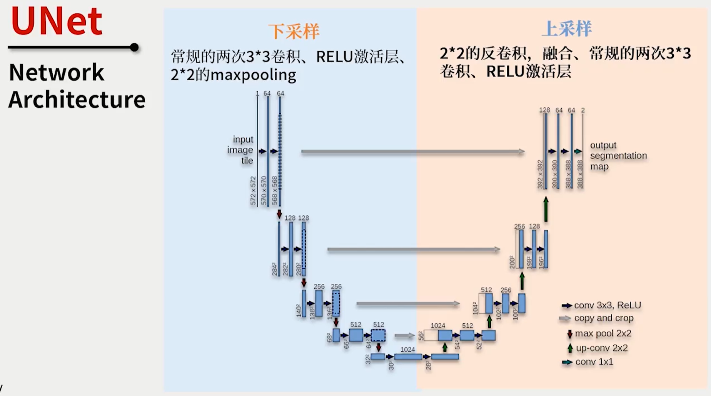
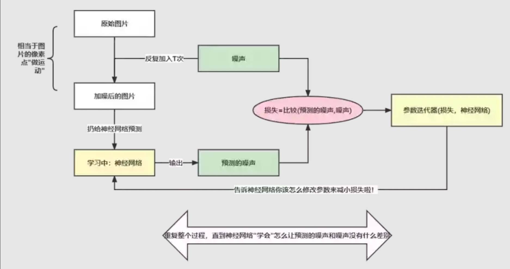
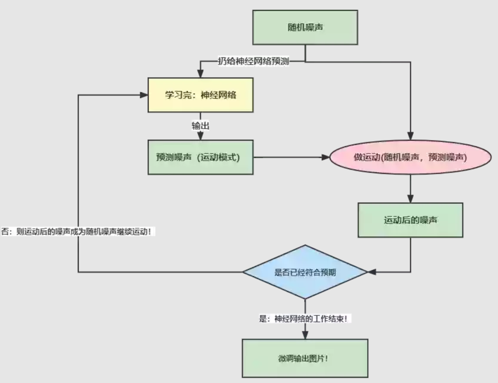

- [CV 相关知识点笔记](#cv-相关知识点笔记)
  - [Mask 掩膜](#mask-掩膜)
  - [上采样 (UnSampling)、下采样 (DownSampling)](#上采样-unsampling下采样-downsampling)
  - [步幅 (Stride) 和填充 (padding)](#步幅-stride-和填充-padding)
  - [图像评价指标](#图像评价指标)
    - [PSNR](#psnr)
    - [SSIM](#ssim)
    - [LPIPS](#lpips)
  - [VAE（变分自编码器）](#vae变分自编码器)
    - [AE 自编码器](#ae-自编码器)
    - [VAE 变分自编码器](#vae-变分自编码器)
  - [U-Net](#u-net)
    - [1. 基本架构](#1-基本架构)
    - [2. Encoder 部分](#2-encoder-部分)
    - [3. Decoder 部分](#3-decoder-部分)
  - [Skip Connection](#skip-connection)
  - [Diffusion Model](#diffusion-model)
    - [高斯噪声](#高斯噪声)
    - [学习过程](#学习过程)
    - [去噪过程](#去噪过程)
  - [Attention 机制](#attention-机制)
    - [CrossAttenton](#crossattenton)
  - [CLIP（进行图文匹配）（未学习完）](#clip进行图文匹配未学习完)
  - [Stable Diffusion](#stable-diffusion)
    - [1. 论文贡献](#1-论文贡献)
    - [2. 整体架构](#2-整体架构)
    - [3. 感知压缩](#3-感知压缩)
    - [4. 潜在扩散模型](#4-潜在扩散模型)
    - [5. 条件机制](#5-条件机制)
  - [Fine-tuning（未学习）](#fine-tuning未学习)
  - [Canny 边缘检测](#canny-边缘检测)
    - [1. 图像降噪](#1-图像降噪)
    - [2. 计算图像梯度（Sobel 算子）](#2-计算图像梯度sobel-算子)
    - [3. 非极大值抑制](#3-非极大值抑制)
    - [4. 双阈值筛选](#4-双阈值筛选)
  - [ControlNet (内容基于上文的知识)](#controlnet-内容基于上文的知识)
    - [Introduction](#introduction)
    - [Method](#method)
      - [0. 整体结构](#0-整体结构)
      - [1. zero 卷积层](#1-zero-卷积层)
      - [2. Training](#2-training)
    - [总结的见解（待续）](#总结的见解待续)
  - [Code 部分学习](#code-部分学习)
    - [1. Canny 模型各个输入参数（未学习）](#1-canny-模型各个输入参数未学习)
    - [2. yaml 配置文件参数（未学习）](#2-yaml-配置文件参数未学习)
    - [3. 完整结构（转）](#3-完整结构转)
    - [4. ControlLDM 核心模块](#4-controlldm-核心模块)
    - [4.1 timestep](#41-timestep)
    - [4.2 Embedding](#42-embedding)
    - [5. 各个 Block（未学习）](#5-各个-block未学习)
    - [6. 训练](#6-训练)
      - [数据集准备](#数据集准备)

# CV 相关知识点笔记
> 记录下学习过程中遇到的概念和知识点

## Mask 掩膜
* 用选定的图像、图形或物体，对处理的图像（全部或局部）进行遮挡，来控制图像处理的区域或处理过程
* 提取感兴趣区：用预先制作的感兴趣区掩膜与待处理图像相乘，得到感兴趣区图像，感兴趣区内图像值保持不变，而区外图像值都为 0
* 屏蔽作用：用掩膜对图像上某些区域作屏蔽，使其不参加处理或不参加处理参数的计算，或仅对屏蔽区作处理或统计
* 结构特征提取：用相似性变量或图像匹配方法检测和提取图像中与掩膜相似的结构特征
* 举例：  
  
  

## 上采样 (UnSampling)、下采样 (DownSampling)
* 下采样
  * 缩小图像
  * 使得图像符合显示区域的大小
  * 生成对应图像的缩略图
* 上采样
  * 放大图像
  * 显示在更高分辨率的设备上

## 步幅 (Stride) 和填充 (padding)
* 步幅
  * 卷积核经过输入特征图的采样间隔
  * 希望减小输入参数的数目，减少计算量
* 填充
  * 在输入特征图的每一边添加一定数目的行列，使得输出的特征图的长、宽 = 输入的特征图的长、宽
  * 希望每个输入方块都能作为卷积窗口的中心
* 输入特征图和输出特征图的关系
  > 一个尺寸 a * a 的特征图，经过 b * b 的卷积层，stride=c，padding=d，输出的特征图尺寸？  
  > 输出的特征图尺寸 =（a + 2d - b）/ c + 1
  * 一个特征图尺寸为 5 * 5 的输入，使用 3 * 3 的卷积核，步幅 = 1，填充 = 1，输出的尺寸 = (5 + 2 * 1 - 3) / 1 + 1 = 5  
  
  

## 图像评价指标
> 参考 [上周总结1_图像上色评价指标.docx](../Week04_0509/上周总结1_图像上色评价指标.docx)  
> 参考 [B站讲解](https://www.bilibili.com/video/BV1eG4y1D73A/)  
> 参考 [协方差矩阵](https://www.cnblogs.com/pengkunfan/p/3947529.html)

PSNR 和 SSIM 的值越高，LPIPS 的值越低，图像质量越好

### PSNR
峰值信噪比，越大越好

### SSIM
衡量图像相似度，[0, 1]，值越大越好
* 亮度 - 均值 $\mu$
* 对比度 - 标准差 $\delta$
* 结构相似 - 协方差
* 采用圆对称的高斯加权公式。一个高斯核作为滑动窗口，求局部的均值和方差，最后对所有局部 SSIM 求均值
* 可能用作Loss来监督图像生成的训练 - SSIMD。图像越不相似，SSIMD值越接近于 1

### LPIPS
学习感知图像块相似度。用图像的深度特征来衡量两张图片的相似度
* 上面两种评价指标对平滑的图像会失效
* 对所有层的误差取平均，得到相似度d0。图像x，x0之间的相似度越低，深度特征之间的差异也就越大，LPIPS的输出结果（d0）也就越大

## VAE（变分自编码器）
### AE 自编码器
假设任何人像图片都可以由表情、肤色、性别、发型等几个特征的取值来唯一确定，那么我们将一张人像图片输入自动编码器后将会得到这张图片在表情、肤色等特征上的取值的向量X’，而后解码器将会根据这些特征的取值重构出原始输入的这张人像图片  

  

### VAE 变分自编码器
在实际情况中，我们可能更多时候倾向于将每个潜在特征表示为可能值的范围。例如，如果输入蒙娜丽莎的照片，将微笑特征设定为特定的单值（相当于断定蒙娜丽莎笑了或者没笑）显然不如将微笑特征设定为某个取值范围（例如将微笑特征设定为 x 到 y 范围内的某个数，这个范围内既有数值可以表示蒙娜丽莎笑了又有数值可以表示蒙娜丽莎没笑）更合适。而变分自编码器便是用“取值的概率分布”代替原先的单值来描述对特征的观察的模型，如下图的右边部分所示，经过变分自编码器的编码，每张图片的微笑特征不再是自编码器中的单值而是一个概率分布  

  

## U-Net
> 图像分割  
> 参考 [U-Net原理分析与代码解读](https://zhuanlan.zhihu.com/p/150579454)

### 1. 基本架构  
  
  
  > Encoder-Decoder 结构。蓝色部分 Encoder，由卷积和下采样组成；红色部分 Decoder，比较关键的步骤就是上采样 与 skip-connection。  
  
  > 蓝/白色框表示 feature map；蓝色箭头表示 3 * 3 卷积，用于特征提取  
  > 灰色箭头表示 skip-connection，用于特征融合  
  > 红色箭头表示池化 pooling，用于降低维度  
  > 绿色箭头表示上采样 upsample，用于恢复维度  
  > 青色箭头表示 1 * 1 卷积，用于输出结果  
  > 其中灰色箭头中的 copy 就是 concatenate 而 crop 是为了让两者的长宽一致

### 2. Encoder 部分
* 卷积结构统一为 3 * 3 的卷积核，padding 为 0 ，striding 为 1
* 没有 padding 所以每次卷积之后 feature map 的 H 和 W 变小了
* 两次卷积之后是一个 stride 为 2 的 max pooling，输出大小变为 1/2 * (H, W)
* 最后一次没有 max-pooling，直接将得到的 feature map 送入

### 3. Decoder 部分
* 文中采用插值方式
* 将一个 2 * 2 的矩阵通过插值的方式得到 4 * 4 的矩阵，那么将 2 * 2 的矩阵称为源矩阵，4 * 4 的矩阵称为目标矩阵  
  
  

## Skip Connection
* 解决 gradient vanished 问题
* 在深度网络的中间层额外加入浅层的 input，使得 gradient 的“路径”不再那么长。类似提供一个复合路径，在原来的“长路径”的基础上，现在额外添加一个“捷径”
* addition 方式  
  
  

* concatenation 方式  
  
  
  > 在一个 Dense Block 中，较浅层的输入会 concatenated 在一起输入下一次层网络。一层层递推，越往后的层，获得 concatenated 的信息就越多。这种方式可以多很多条“捷径”，浅层的输入直接有通道通往 block 的输出层。

* （转）个人理解在 addition 的方式下，feature map 的维度没有变化，但每个维度都包含了更多特征，对于普通的分类任务这种不需要从 feature map 复原到原始分辨率的任务来说，这是一个高效的选择；而 concatenation 则保留了更多的维度/位置信息，这使得后面的 layer 可以在浅层特征与深层特征自由选择，这对语义分割任务来说更有优势。

## Diffusion Model
> 参考 [Stable Diffusion｜生成图像的工作原理](https://openai.wiki/stable-diffusion-introduce.html)

扩散模型包括两个过程：前向（学习）过程和反向过程（去噪），都是一个参数化的马尔可夫链  
  

### 高斯噪声
和原来图像像素值相关的噪声。某个强度的噪声点个数最多，离这个强度越远噪声点个数越少，且这个规律服从高斯分布。

### 学习过程
  
> 输入带噪图片，步数t，模型预测噪声，模型训练目标：预测噪声与实际加入噪声的误差越小越好（Loss损失函数约束距离）。

### 去噪过程
  
> 将有噪声的图像（第一张图像为随机采样的高斯分布噪声）减去模型预测的噪声（噪声前面的其它参数可以由上面加噪的过程反向推导出来）不断把噪声去掉以恢复出原始的图像。

## Attention 机制
> 参考 [一文看懂 Attention](https://zhuanlan.zhihu.com/p/91839581)  
> 参考 [讲解_Transformer_Attention.pdf](./讲解_Transformer_Attention.pdf)  
> 参考 [多模态条件机制 Cross Attention](https://mp.weixin.qq.com/s?__biz=Mzk0MzIzODM5MA==&mid=2247486441&idx=1&sn=06df067828b19ef9aeef99f455f897e9&chksm=c337b670f4403f663f7b98a2aa75cb5062bf5a6222c81ce8f181d79d367971a4587b62da84a1#rd)

将有限的注意力集中在重点信息上，从而节省资源，快速获得最有效的信息

* 举例
> 图书馆（source）里有很多书（value），为了方便查找，我们给书做了编号（key）。当我们想要了解漫威（query）的时候，我们就可以看看那些动漫、电影、甚至二战相关的书籍。为了提高效率，并不是所有的书都会仔细看，针对漫威来说，动漫，电影相关的会看的仔细一些（权重高），但是二战的就只需要简单扫一下即可（权重低）

* 原理  

  
  > 1. query 和 key 进行相似度计算，得到权值  
  > 2. 将权值进行归一化，得到直接可用的权重  
  > 3. 将权重和 value 进行加权求和

  * Q 是 Query，是输入的信息，即当前任务的目标，用于和 key 进行匹配；
  * K 和 V 分别是 Key 和 Value，一般是相同的数据，比如原始文本经过 Embedding 后的表征；
  * 通过计算 Q 与 K 之间的相关性，得到权重，再将权重进行类似于 softmax 的归一化操作，表示不同的 key 对于 Q 的重要程度，或者说权重越大，我们就会把更多的注意力放到其对应的 value 上；
  * 用权重再与对应的 Value 相乘，意思是我们从 Value 中提取到的重要信息，或者说是对 Q 有用的信息；
  * 加权后的结果再求和就得到了针对 Query 的 Attention 输出，用新的输出代替原来的 Q 参与之后的一系列运算。

### CrossAttenton
用于处理两个不同模态序列之间的关联，在多模态场景中用于将**文本和图像等不同类型的数据**进行交互处理  

  

这里假设输入为图像和文本，我们通常将图像信息作为 Q，文本信息作为 K 和 V，因为我们希望**根据文本序列中的信息来选择图像的局部区域，换句话说是以文本为条件控制图像的生成**，所以通过注意力的形式来计算每个文本序列与图像不同区域之间的关联程度，即对于每个文本单词计算它与图像所有位置的相似度得分，然后归一化，并用它们加权求和得到最终加入条件控制的图像表示

* 对于两个不同模态的序列：图像生成Q，文本生成K、V；
  *  注意两个不同模态的序列在最后一个维度上要等同，即 WQ 维度为 [c, d]，WK、WV 维度为 [d, d]；
* 对于 Q 的每个位置，计算它与 K 中所有位置的关联程度，得到相似度矩阵；
* 将相似度矩阵归一化后得到权重矩阵，表示图像 Q 与文本 K 各个位置之间的关联程度；
* 然后再与 V 相乘进行加权求和，得到加入条件注意力后的新的图像表示，并且它与输入图像维度一致。  

这样 cross-attention 就可以帮助模型学习不同序列之间的关联了，能更好地处理不同模态类型的数据。

## CLIP（进行图文匹配）（未学习完）
> 参考 [Stable Diffusion｜生成图像的工作原理](https://openai.wiki/stable-diffusion-introduce.html)

## Stable Diffusion
> Stable Diffusion 基于 Latent Diffusion Models，专门用于文图生成任务  
> Latent Diffusion Models 通过在一个潜在表示空间中迭代“去噪”数据来生成图像，然后将表示结果解码为完整的图像  
> 参考 [Stable Diffusion原理解读](https://zhuanlan.zhihu.com/p/583124756), [十分钟读懂Stable Diffusion](https://zhuanlan.zhihu.com/p/600251419), [从头到尾看Stable Diffusion WebUI（一）](https://zhuanlan.zhihu.com/p/609022600)

### 1. 论文贡献
* Diffusion model 相比 GAN 可以取得更好的图片生成效果，然而该模型是一种自回归模型，需要复迭代计算，代价高。论文提出一种在 latent space 上进行 diffusion 过程的方法
* 论文将该模型在无条件图片生成 (unconditional image synthesis)，图片修复 (inpainting)，图片超分 (super-resolution) 任务上进行了实验，效果不错
* 论文还提出了 cross-attention 方法实现多模态训练，使得条件图片生成任务也可以实现
  
### 2. 整体架构

> 首先需要训练好一个自编码模型（AutoEncoder，包括一个编码器 E 和一个解码器 D）。这样一来，我们就可以利用编码器对图片进行压缩，然后在 latent space 上做 diffusion 操作，最后我们再用解码器恢复到原始像素空间。  
> 条件机制中的 switch 作用是，不是所有类型的多模态条件特征都需要进行注意力计算的，也可以直接 concat 来融合

### 3. 感知压缩
* 通过 VAE 这类自编码模型对原图片进行处理，忽略掉图片中的高频信息，只保留重要、基础的一些特征
* 需要训练一个通用的自编码模型，用于不同的扩散模型的训练，在不同的任务上使用
* 基于感知压缩的扩散模型的训练本质上是一个两阶段训练的过程，第一阶段需要训练一个自编码器，第二阶段才需要训练扩散模型本身

### 4. 潜在扩散模型
* 普通扩散模型可以解释为一个时序去噪自编码器，根据输入 xt 去预测一个对应去噪后的变体，或者说预测噪音，其中 xt 是输入 x 的噪音版本
* 潜在扩散模型中，引入了预训练的感知压缩模型，可以利用编码器得到 zt，对 zt 进行扩散

### 5. 条件机制
* 除了无条件图片生成外，我们也可以进行条件图片生成
* 在 U-Net 主干网络上增加 cross-attention 机制（黄色方块）
* 通过一个 cross-attention 层映射将控制信息融入到 U-Net 的中间层
* 经过了 T 轮的 U-Net 网络（去噪过程）

## Fine-tuning（未学习）

## Canny 边缘检测
> 参考 [Canny 边缘检测算法](https://blog.csdn.net/minjiuhong/article/details/89320225)  
> 参考 [Canny 边缘检测](https://blog.csdn.net/saltriver/article/details/80545571)  
> 参考 [Canny 边缘检测](https://blog.csdn.net/qq_40243295/article/details/104391755)  
> 参考 [0425_汇报稿.docx](../Week02_0425/0425_汇报稿.docx)  
> 参考 [上周总结3_计算图像梯度.docx](../Week04_0509/上周总结3_计算图像梯度.docx)

找到图像中像素亮度发生剧烈变化像素点的集合，通常这些集合表现出来往往就是图案边缘。  
Canny 边缘检测主要有几个步骤：图像降噪、计算图像梯度、非极大值抑制、阈值筛选。

### 1. 图像降噪
* 无用的信息形式出现，扰乱图像的可观测信息。通俗的说就是噪声让图像不清楚
* 高斯模糊
  * 简单说就是将每个像素点和周围像素点，以某种方式进行混合, 实现既不改变原图的大致形态，看上去还是原来的样子，但却模糊了的效果
* 去除图像的细节部分，图像噪声可大大减少，而图像的边缘信息损失较少，这样对后续检测的效果会更好

### 2. 计算图像梯度（Sobel 算子）
* 计算图像梯度可能得到图像边缘。梯度反映的是函数快速变化的方向和大小，而在图像中，边缘是像素值快速变化的地方，其灰度值变化较大，梯度值也较大，因此计算图像的梯度可以得到所有可能是边缘的集合

### 3. 非极大值抑制
* 找到局部极大值，并筛除（抑制）邻域内其余的值
* 根据上一步获取的梯度方向，将图像像素点沿梯度方向（梯度方向是边的垂直方向）或逆方向的邻域像素点进行比较，如果为最大值则保留，否则抑制，即设置像素点为0

### 4. 双阈值筛选
* 设置两个阈值，一个 high阈值和一个 low 阈值。value > high，则表示是强边缘点（真实边缘点）；low < value < high，则是弱边缘点；value < low，抑制（剔除）
* 接下来进一步对弱边缘点判断，如果其领域内有强边缘点，保留，否则剔除
* 这样做的目的是，如果只保留强边缘点，有些边缘可能会不闭合，需要从 [low, high] 之间的点进行补充，使得边缘尽可能的闭合
* 弱边缘点的处理原则是因为真实边缘的弱边缘点都存在强边缘点

## ControlNet (内容基于上文的知识)
> 参考 [向文本到图像扩散模型添加条件控制](https://cloud.tencent.com/developer/article/2224020?)  
> 参考 [0425_汇报稿.docx](../Week02_0425/0425_汇报稿.docx)

端到端的神经网络架构，可控制大型图像扩散模型（如稳定扩散）以学习特定于任务的输入条件。文本到图像扩散模型生成的图本质上是通过 prompt 进行引导从噪声中生成的，text 是唯一的输入，而 ControlNet 输入了 text 之外额外的一个维度，通过 Canny 模型限制图像的结构（边缘）。

### Introduction
* 将大型扩散模型的权重克隆为“可训练副本”和“锁定副本”
  * 锁定副本：保留了从数十亿图像中学习的网络能力
  * 可训练副本：特定任务的数据集上进行训练以学习条件控制
* 使用不同条件的各种数据集训练了几个 ControlNet，例如 Canny 边缘、Hough 线、用户涂鸦、人体关键点、分割图、形状法线、深度等

### Method
#### 0. 整体结构  

#### 1. zero 卷积层
  > 在进行自己的模型训练开始之前，所有零卷积输出都是零，此时模型仍然是原始的Stable Diffusion Model；在加入自己的训练数据之后，则会对最终数据产生影响，这里的影响，更多是对最终结果的微调（fine-tuning），因此不会导致模型出现重大偏离的情况

  *  1×1 卷积层，其权重和偏置都用 0 初始化  
  
    

  * 权重和偏差都被初始化为 0，第一步 yc = y，也就是不改变 Stable Diffusion 原始训练模型  
  
  

  * 0 卷积的梯度计算  
  
    

  

#### 2. Training
  * 图像扩散模型学习逐步对图像进行去噪以生成样本。去噪可以发生在 pixel space 或从训练数据编码的 latent space 中。Stable Diffusion 使用潜像作为训练域

  * 给定图像 z0，扩散算法逐渐向图像添加噪声并产生噪声图像 zt，其中 t 是添加噪声的次数。当 t 足够大时，图像近似于纯噪声。给定一组条件，包括时间步长 t、文本提示 ct 以及任务特定条件 cf，图像扩散算法学习网络 θ 以预测添加到噪声图像 zt 的噪声。其中 L 是整个扩散模型的总体学习目标  

  

### 总结的见解（待续）
我们输入一张线稿图给 ControlNet，ControlNet 通过边缘检测理解图上包含了什么信息，然后在边缘的引导下对线稿进行上色，因为我们的 stable diffusion 模型一开始是在大数据集上训练的，所以生成出来的图可能比较大众化，有时候我们并不满意这个结果，想要生成特定颜色、特定风格的图片，我们可以将我们的 prompts 加入进去，通过 clip 模型来达到自然语言与图像的匹配，并在边缘的约束下将图像创作到其所在的区域，最后达到我们想要的上色效果。
Ai 上色与我们一般意义上的人工上色有所区别，人工上色是我们看到一张线稿，理解线稿上的内容并决定线稿每个区域应该填充的颜色，而 ai 上色是理解线稿上的内容，再由 ai 根据 prompts 自由创作和我们的线稿图内容类似的图像，并通过 controlnet 的 canny 模型检测线稿的边缘信息来决定生成图像的位置布局，这是一个从无到有的过程。
假设我们不用 controlnet，单纯用 sd 模型，将我们的线稿图输入进去，我们发现模型生成出来的图片只是形状与原图片相似，可以说完完全全是一张新的图片，因为他并没有理解我们图像中具体包含了什么内容，只是根据我们的 prompts 将原图像魔改成提示词中所要实现的效果。
而当我们加入 controlnet 之后，controlnet 会去检测图像的边缘信息，理解图像每个部分包含的含义，并将此作为一种特殊的 prompts 传递给 sd 模型，所以在无参考提示的情况下，sd 模型仍能够生成我们所期望的图像，在生成图像的过程中，模型会受到 controlnet 的引导，使得图像生成在线稿约束的区域之中，总而言之，controlnet 在线稿上色中承担了两个作用，一个是提取图像的特征，作为模型的 prompts，另一个是控制图像的布局，使其呈现上色的效果。

## Code 部分学习
> 参考 [万字长文解读](https://blog.csdn.net/xian0710830114/article/details/129194419)  
> 参考 [ControlNet 前向代码解析](https://blog.csdn.net/u012193416/article/details/129956546)  
> 参考 [ControlNet 参数条件详解](https://blog.csdn.net/qcwlmqy/article/details/130355876)

### 1. Canny 模型各个输入参数（未学习）
* Guess Mode
* DDIM Sampler
* Canny low threshold
* Canny high threshold
* steps
* Guidance Scale
* Seed
* eta (DDIM)
* Added Prompt
* Negative Prompt

### 2. yaml 配置文件参数（未学习）

### 3. 完整结构（转）
  

* 输入
  * Map Input: Canny 图（线稿图）
  * Prompt: 用户输入提示词
  * Added Prompt: 附加提示词
  * Negative Prompt: 负面提示词
  * Random Input: 随机图（？）
* 流程
  * Prompt 和 Added Prompt 连个字符串拼接到一起经过 CLIPEmbedder 得到文本的空间表示（两个FrozenCLIPEmbedder共享参数）
  * 然后与 Map Input、Random Input 一同送入 ControlNet 核心模块 ControlLDM（Latent Diffusion）然后循环20次（对应页面参数Steps）
  * 其中 timesteps 每个时间步不一样，以 `Steps=20` 为例，timesteps 分别等于[1,51,101,151,201,251,301,351,401,451,501,551,601,651,701,751,801,851,901,951]（为什么）
  * Negative Prompt 也做类似操作，然后将 Negative Prompt 和 Prompt 的输出做加权，公式如下，其中 GuidanceScale 为页面参数，默认为 9：  
  `out = GuidanceScale ∗ PromptOut + (GuidanceScale − 1) ∗ NegativePrompt`  
  最后经过 Decode First Stage 还原成原图片大小

### 4. ControlLDM 核心模块

* 主要流程
  1. [timesteps](#41-timestep) 经过 [Embedding](#42-embedding) 转换为特征向量送入 Stable Diffusion 和 ControlNet
  2. 随机噪声被送入 Stable Diffusion
  3. 图像的 Map 经过 HintBlock，与随机噪声相加，送入 ControlNet
  4. Prompt 的 Embedding 送入 Stable Diffusion 和 ControlNet
  5. Stable Diffusion 的所有参数被冻结不参与训练，Stable Diffusion 由三个 SDEncoderBlock、两个 SDEncoder、一个 SDMiddleBlock、两个 SDDecoder 和三个 SDDecoderBlock 组成
  6. ControlNet 的结构与 Stable Diffusion 一致，只是每层后面增加一个零卷积
  7. Stable Diffusion 和 ControlNet 中的 ResBlock 将上一层的输出和 timesteps 作为输入
  8. Stable Diffusion 和 ControlNet 中的 SpatialTransformer 将上一层的输出和 Prompt Embedding 作为输入

### 4.1 timestep
每次给模型 timestep 个连续时间序列的数据  

  

* 如果 `[batch_size, time_step, input_size] = [30, 5, 7]`
* 上图中，黑色框代表的就是一个 batch_size 中所含有的数据的量
* 从上到下的 3 个红色框就为 time_step = 5 时每次细胞输入门所输入的数据量
* 列B~列H，一共 7 列，就为 input_size
* time_step = n, 就意味着我们认为每一个值都和它前 n 个值有关系
* 假如没有 time_step 这个参数，`[input_size=7, batch_size=30]`，一共只需要 1 次就能训练完所有数据
* 如果有，那么变成了 `[input_size=7, batch_size=30, time_step=5]`，需要 30 - 5 + 1 = 26，需要 26 次数据连续喂给模型，中间不能停
* 在 26 次中每一次都要把上一次产生的 y，与这一次的 5 行连续时间序列数据一起 feed 进去，再产生新的 y 
* 以此往复，直到此个 batch_size 结束

### 4.2 Embedding
通过矩阵乘法实现数据的降维和升维

### 5. 各个 Block（未学习）

### 6. 训练
#### 数据集准备
1. 原图（ground truth）
2. CannyMap 图（线稿图）（condition image）
3. 对应 Prompt 文字（prompt）